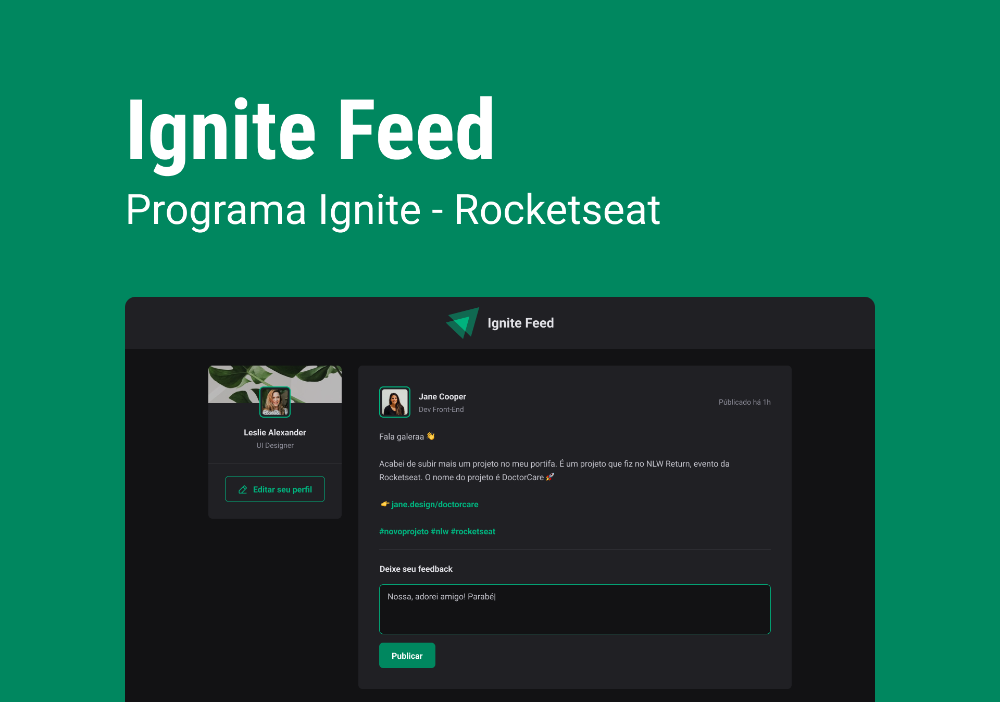

# Ignite Feed

O Ignite Feed imita uma rede social com vários posts na nossa timeline, podendo realizar comentários dentro dos posts, dar um like e também remover os posts.

## Tecnologias utilizadas:

- HTML
- CSS module
- Typescript
- ReactJS
- Vite

## Para visualizar o projeto funcionando, clique no link abaixo !

[Link](https://ignitee-feed.vercel.app/)
